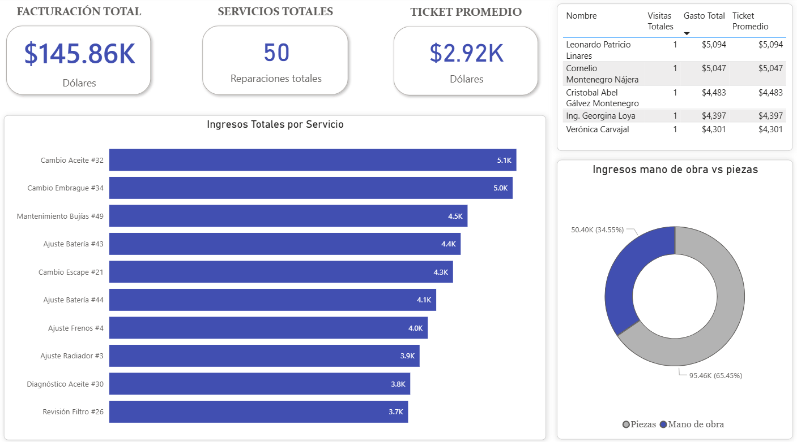

# 🛠️ Taller Don Chuy — End-to-End Analytics Engineering Pipeline


An end-to-end Analytics Engineering solution designed to transform raw transactional data from an automotive service center into scalable, executive-level business intelligence. This project demonstrates full-stack data capabilities: building a modular Python ETL pipeline, engineering a robust MySQL relational database with custom analytical views, and deploying an interactive Power BI dashboard.

---

## 📊 Executive Dashboard Preview

> **Business Impact:** Translates over 50+ service records into actionable insights, enabling stakeholders to instantly identify that spare parts account for 65.45% of total revenue, driving better inventory forecasting and vendor negotiation.



---

## 🎯 The Business Challenge & Solution

Automotive repair centers often generate rich operational data across clients, vehicles, and services, but struggle to consolidate these siloed records into strategic visual metrics.

* **The Challenge:** Lack of centralized visibility into total billing, service line profitability, labor vs. parts cost split, and customer retention metrics.
* **The Engineering Solution:** 
  1. Developed a **custom Python ETL pipeline** to standardize and automate data ingestion with built-in logging and integrity constraints.
  2. Engineered a **MySQL Data Mart** using optimized SQL views (`v_fact_reparaciones`, `v_kpi_servicios`, `v_kpi_clientes`) to decouple complex data logic from the presentation layer.
  3. Deployed a **minimalist Power BI Dashboard** utilizing a standardized corporate UI/UX (`#1B365D` palette) to deliver immediate macro and micro financial insights.

---

## 📂 Repository Structure


```text
DonChuy/
├── config/             # Connection configurations & environment variables
├── logs/               # Automated pipeline execution logs for debugging
├── models/             # Analytical SQL views & database schema scripts
│   ├── v_fact_reparaciones.sql
│   ├── v_kpi_clientes.sql
│   └── v_kpi_servicios.sql
├── PowerBI/            # Power BI Desktop report files (.pbix)
├── Snapshots/          # High-resolution documentation images & visual assets
├── src/                # Core ETL pipeline Python modules (Extraction & Loading)
│   └── pipeline.py
├── .gitignore          # Git exclusion rules (.venv, local credentials)
├── main.py             # ETL pipeline execution entry point
├── README.md           # Project documentation
└── requirements.txt    # Python dependencies (mysql-connector-python, pandas, etc.)
```

## 🔑 Key Analytics & Insights Derived
Macro Financial Health: Continuous tracking of Total Revenue ($145.86K), Total Completed Services (50), and Average Ticket Size ($2.92K).

Service Line Profitability: Automated ranking of top revenue-generating services (e.g., Oil Changes, Clutch Replacements).

Cost Center Analysis: Accurate evaluation of the total income ratio between Labor (~34.55%) vs. Spare Parts (~65.45%).

Customer Intelligence: Identification and ranking of VIP clients by total lifetime expenditure to drive loyalty programs.

--

## 🚀 Getting Started (Local Deployment)

### 1.-Clone the repository:
git clone [https://github.com/Oscar-Jiram/taller-donchuy-analytics.git](https://github.com/Oscar-Jiram/taller-donchuy-analytics.git)
cd taller-donchuy-analytics

### 2.-Set up the virtual environment:
python -m venv .venv
source .venv/bin/activate  # On Windows: .venv\Scripts\activate
pip install -r requirements.txt

### 3.-Run the ETL Pipeline:
python main.py


--

Deploy the BI Layer:

Execute the SQL scripts located in models/ within MySQL Workbench to generate the analytical views.

Open PowerBI/Don_ChuyBI.pbix to interact with the executive dashboard.

## 👤 Author

**Oscar Jiram**  
*Data Analyst & Analytics Engineer*  

Specialized in designing end-to-end data architectures—from robust Python/SQL ETL pipelines to high-impact Business Intelligence dashboards. Focused on transforming complex operational data into strategic assets for data-driven decision-making. Actively exploring 100% remote roles to drive data strategy on a global scale.

[](https://www.linkedin.com/in/TU_USUARIO)
[](https://github.com/Oscar-Jiram)
